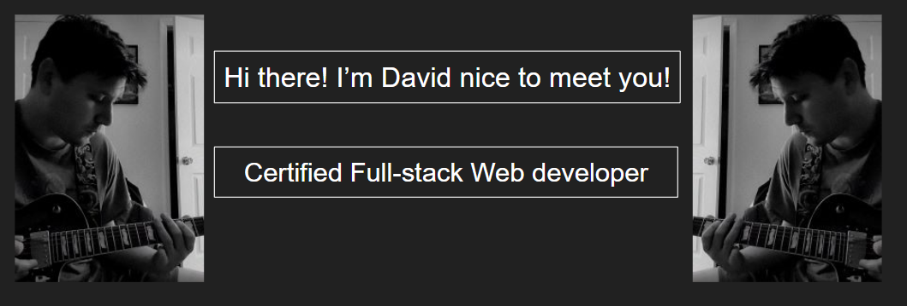

- 🔭 I’m currently working on a magic the gathering deck builder using mongoDB as my backend database along with MTG's open API.
- 🌱 I’m currently studying more backend tools and looking to rack up some more certifcations.
- ⚡ Fun fact: ...
- 📫 How to reach me: ...
